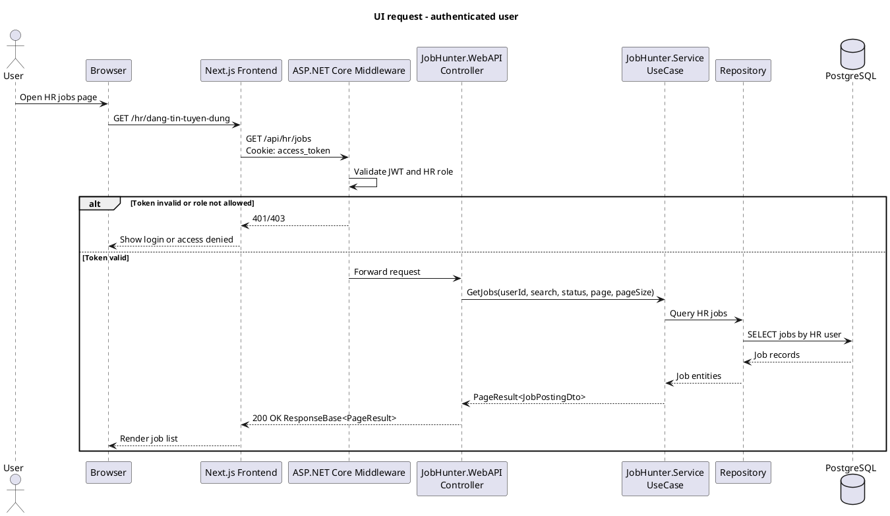
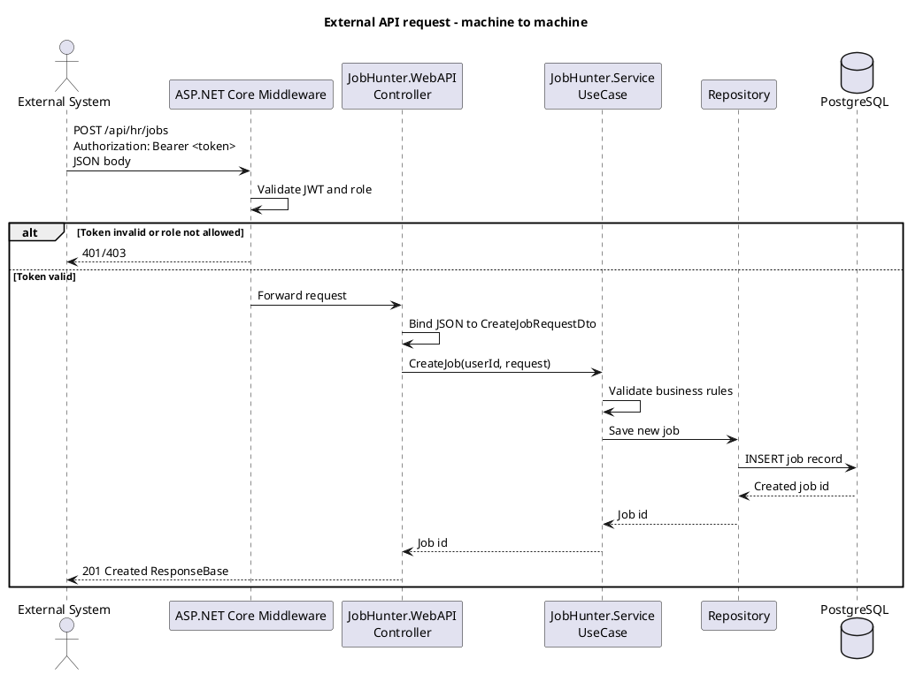
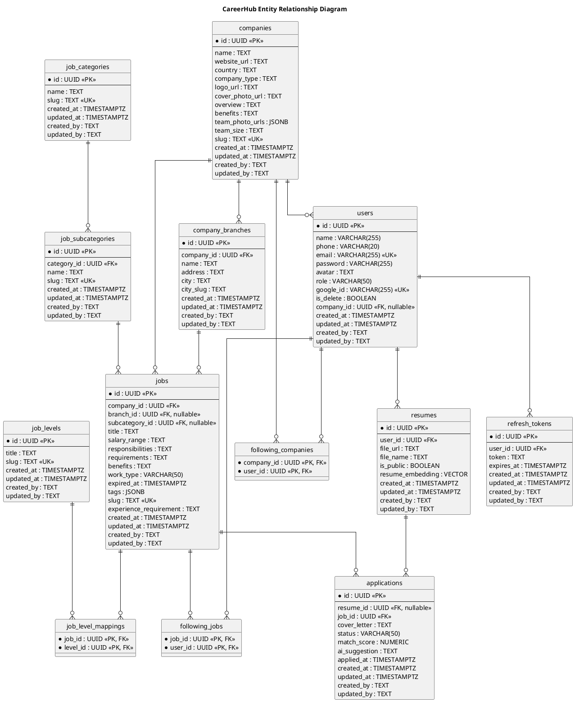

**Technical Design Specification**

***{{******Project Name****** (******CODE******)}}****** – Report ******4***

| Version | *{{VERSION}}* |
| --- | --- |
| Date | *{{DATE}}* |

# Change Log

| **Version** | **Date** | **Author** | **Summary** |
| --- | --- | --- | --- |
| 1.0 | *{{DATE}}* | *{{TECH_LEAD}}* | Initial draft |

# Table of Contents

	Change Log	1

	Table of Contents	2

	1. Tech Stack	4

	1.1 Technology Choices	4

	1.2 External Integrations	4

	1.3 Decision Rationale	4

	2. Architecture Overview	5

	2.1 High-Level Architecture	5

	2.2 Layer Responsibilities	5

	2.3 Package Convention (Package Diagram)	6

	2.4 Request Lifecycle (Sequence Diagram)	6

	UI request (authenticated user):	6

	External API request (machine-to-machine):	6

	3. Data Model	6

	3.1 Entity Definitions	7

	Tables: users, companies, company_branches	7

	Tables: job_categories, job_subcategories, job_levels	7

	Tables: jobs, job_level_mappings, following_companies, following_jobs, resumes, applications, refresh_tokens	8

	3.2 Entity Relationships	8

	3.3 Enum / Lookup Values	8

	3.4 Indexing Strategy	9

	3.5 Migration Strategy	9

	3.6 Seed Data	9

	Current seeded lookup data	9

	Minimum manual test data	10

	4. Security Design	10

	4.1 UI Authentication	10

	4.2 Authorization Layer	11

	Current endpoint authorization	11

	4.3 Password Policy	11

	4.4 Account Lockout Policy	11

	4.5 Secrets Management	12

	4.6 OWASP Top 10 Mitigation Checklist	12

	4.7 Security Filter Chain Configuration	12

	4.8 External API Authentication (API-type UCs)	12

	api_keys table:	13

	5. UI/UX Conventions	13

	5.1 Design Reference	13

	5.2 Standard Page Layout	13

	5.3 Component Conventions	14

	5.4 Partial Update Pattern	14

	5.5 Flash Message Convention	14

	5.6 Responsive Breakpoints	15

	5.7 Accessibility	15

	6. Configuration & Environment	15

	6.1 Application Configuration	15

	6.2 Environment Variables	16

	6.3 Build Dependencies	16

	6.4 Deployment Notes	16

	7. File & Storage Conventions	17

	7.1 Upload Path Structure	17

	7.2 File Validation Rules	17

	7.3 Serving Strategy	17

	7.4 Retention & Cleanup Policy	18

	8. Error Handling & Logging	18

	8.1 Global Error Handling	18

	8.2 Logging Configuration	18

	8.3 Audit Trail	18

	9. Performance Constraints	19

	9.1 Targets	19

	9.2 Caching Strategy	19

	9.3 Known N+1 Risk Points	19

# 1. Tech Stack

| **Guidance** Pin exact versions — 'latest' is not acceptable. Fill Decision Rationale even for obvious choices — prevents revisiting the same debates 6 months later. |
| --- |

## 1.1 Technology Choices

| **Layer** | **Technology** | **Version** | **Notes** |
| --- | --- | --- | --- |
| Backend API framework | ASP.NET Core Web API | 10.0.8 | REST API hosted by `JobHunter.WebAPI`; container listens on port 8080 |
| Backend language/runtime | C# / .NET | 10.0 | Main backend runtime; nullable reference types and implicit usings enabled |
| Backend architecture | 3-Layer Architecture | — | `JobHunter.WebAPI` → `JobHunter.Service` → `JobHunter.Domain` dependency flow |
| ORM | Entity Framework Core | 10.0.8 | Repository implementations use EF Core through `JobhunterContext` |
| Database provider | Npgsql Entity Framework Core Provider | 10.0.1 | PostgreSQL provider for EF Core |
| Database (production) | PostgreSQL | 16.x | Relational store for users, companies, jobs, tokens, and HR data |
| Authentication | JWT Bearer + BCrypt | JWT package 10.0.8; BCrypt.Net-Next 4.2.0 | Access-token API authentication; passwords hashed with BCrypt |
| API documentation | Swashbuckle.AspNetCore | 10.1.7 | OpenAPI/Swagger documentation for backend endpoints |
| File/object storage SDK | AWS SDK for S3 | 4.0.23.4 | Used by backend file service for uploaded assets |
| Frontend framework | Next.js | 16.2.6 | App Router application; standalone Docker output |
| Frontend language | TypeScript | 6.0.3 | Static typing for UI, API clients, and shared types |
| Frontend UI library | React / React DOM | 19.2.6 | Component-based UI rendering |
| Frontend runtime | Node.js | 22-bookworm-slim | Docker base image for build and production runtime |
| CSS framework | Tailwind CSS | 4.3.0 | Utility-first styling; PostCSS plugin `@tailwindcss/postcss` 4.3.0 |
| Component system | shadcn/ui + Radix UI | shadcn 4.7.0; radix-ui 1.4.3 | Reusable application components and accessible primitives |
| Icons | lucide-react | 1.16.0 | Consistent icon library for UI controls |
| Client API transport | Axios | 1.16.1 | HTTP client used by frontend API modules |
| Server-state management | TanStack React Query | 5.100.11 | Query caching, loading states, and server data synchronization |
| Client-state management | Redux Toolkit | 2.12.0 | Global auth/modal state management |
| Form handling | React Hook Form + Zod | React Hook Form 7.76.0; Zod 4.4.3 | Form state, validation schemas, and request payload validation |
| OAuth integration | Google OAuth for React | 0.13.5 | Google sign-in flow on the frontend |
| AI service framework | FastAPI | 0.115.6 | Planned separate Python microservice for AI matching/recommendation endpoints |
| AI service language/runtime | Python | 3.12.8 | Planned runtime for AI service and ML/NLP pipeline code |
| AI service ASGI server | Uvicorn | 0.34.0 | Planned production/dev ASGI server for FastAPI |
| Containerization | Docker / Docker Compose | Compose file format v2 | Builds and runs backend and frontend services; AI service to be added as a third service |

## 1.2 External Integrations

| **Service** | **Purpose** | **Protocol** | **Notes** |
| --- | --- | --- | --- |
| None for this version | — | — | Future versions may integrate with email service and job boards |

## 1.3 Decision Rationale

| **Decision** | **Chosen** | **Alternatives** | **Reason** |
| --- | --- | --- | --- |
| Backend framework | ASP.NET Core Web API | Spring Boot, Node.js/Express | Good for REST APIs and fits the C# backend |
| Backend architecture | 3-Layer Architecture | MVC monolith, microservices-first | Keeps API, business logic, and domain code separate |
| Frontend framework | Next.js + React | Thymeleaf SSR, React SPA with Vite | Supports modern pages, routing, and production builds |
| Frontend language | TypeScript | JavaScript | Helps catch UI and API data errors earlier |
| Styling and components | Tailwind CSS + shadcn/ui + Radix UI | Bootstrap, custom CSS only | Makes reusable and accessible UI faster to build |
| Auth | JWT Bearer + BCrypt | Server session, OAuth-only login | JWT fits separate frontend/backend APIs; BCrypt protects passwords |
| Database | PostgreSQL | MySQL, SQL Server | Reliable relational database with good EF Core support |
| ORM and data access | Entity Framework Core + Repository interfaces | Dapper, raw SQL only | Reduces database code and keeps data access organized |
| API documentation | Swashbuckle/OpenAPI | Manual API documentation | Helps frontend and backend teams test APIs easily |
| Server-state management | TanStack React Query | Manual Axios state, Redux-only fetching | Handles API loading, caching, and refetching |
| Client-state management | Redux Toolkit | React Context only, Zustand | Manages shared UI and auth state clearly |
| AI service platform | FastAPI + Python | .NET ML endpoints, Node.js AI service | Python is strong for AI; FastAPI is simple for AI APIs |
| Containerization | Docker Compose | Manual local setup, single-process deployment | Starts frontend, backend, and AI services consistently |

# 2. Architecture Overview

| **Guidance** Draw the layer diagram before naming packages. Show layers and their roles — not individual classes. For systems with both UI and external API, show both entry points. |
| --- |

## 2.1 High-Level Architecture

## 2.2 Layer Responsibilities

| **Layer** | **Package** | **Responsibility** |
| --- | --- | --- |
| Presentation Layer | JobHunter.WebAPI | Handles API controllers, middleware, request routing, and dependency injection setup |
| Domain Layer | JobHunter.Domain | Stores core entities, enums, and base domain models |
| Service Layer | JobHunter.Service | Handles business logic, use cases, DTOs, repositories, and external services |

## 2.3 Package Convention (Package Diagram)

com.{{company}}.{{project}}

  ├── controller/

  │   └── api/

  ├── service/

  ├── repository/

  ├── model/

  │   ├── entity/

  │   └── dto/

  │       └── api/

  ├── config/

  └── util/

## 2.4 Request Lifecycle (Sequence Diagram)

### UI request (authenticated user):

### External API request (machine-to-machine):

# 3. Data Model

| **Guidance** Physical schema — actual tables, columns, types, and constraints. Column names (snake_case) must match the UCS Request Field names. Enum values must match UCS state machine values exactly. |
| --- |

## 3.1 Entity Definitions

The current physical schema in PostgreSQL uses UUID identifiers generated by `gen_random_uuid()`. Most business tables also include nullable audit columns: `created_at`, `updated_at`, `created_by`, and `updated_by`.

### Table: users

| **Column** | **Type** | **Constraints** | **Notes** |
| --- | --- | --- | --- |
| id | UUID | PRIMARY KEY, DEFAULT gen_random_uuid() | User identifier |
| name | VARCHAR(255) | NOT NULL | Display name |
| phone | VARCHAR(20) | NULLABLE | Contact phone number |
| email | VARCHAR(255) | NOT NULL, UNIQUE | Login email |
| password | VARCHAR(255) | NOT NULL | Hashed password |
| avatar | TEXT | NULLABLE | Profile image URL |
| role | VARCHAR(50) | NULLABLE | Enum: Admin, HR, Candidate |
| google_id | VARCHAR(255) | NULLABLE, UNIQUE | Google OAuth subject identifier |
| is_delete | BOOLEAN | NOT NULL, DEFAULT FALSE | Soft-delete flag |
| company_id | UUID | NULLABLE, FK -> companies.id | Associated company for HR users |
| created_at | TIMESTAMPTZ | NULLABLE, DEFAULT CURRENT_TIMESTAMP | Creation timestamp |
| updated_at | TIMESTAMPTZ | NULLABLE, DEFAULT CURRENT_TIMESTAMP | Last update timestamp |
| created_by | TEXT | NULLABLE | Audit creator |
| updated_by | TEXT | NULLABLE | Audit updater |

### Table: companies

| **Column** | **Type** | **Constraints** | **Notes** |
| --- | --- | --- | --- |
| id | UUID | PRIMARY KEY, DEFAULT gen_random_uuid() | Company identifier |
| name | TEXT | NULLABLE | Company name |
| website_url | TEXT | NULLABLE | Company website |
| country | TEXT | NULLABLE | Operating country |
| company_type | TEXT | NULLABLE | Company classification |
| logo_url | TEXT | NULLABLE | Logo asset URL |
| cover_photo_url | TEXT | NULLABLE | Cover image URL |
| overview | TEXT | NULLABLE | Company overview |
| benefits | TEXT | NULLABLE | Company-level benefits |
| team_photo_urls | JSONB | NULLABLE | Collection of team photo URLs |
| team_size | TEXT | NULLABLE | Human-readable team size |
| slug | TEXT | NULLABLE, UNIQUE | SEO-friendly company slug |
| created_at | TIMESTAMPTZ | NULLABLE, DEFAULT CURRENT_TIMESTAMP | Creation timestamp |
| updated_at | TIMESTAMPTZ | NULLABLE, DEFAULT CURRENT_TIMESTAMP | Last update timestamp |
| created_by | TEXT | NULLABLE | Audit creator |
| updated_by | TEXT | NULLABLE | Audit updater |

### Table: company_branches

| **Column** | **Type** | **Constraints** | **Notes** |
| --- | --- | --- | --- |
| id | UUID | PRIMARY KEY, DEFAULT gen_random_uuid() | Branch identifier |
| company_id | UUID | NOT NULL, FK -> companies.id | Parent company |
| name | TEXT | NULLABLE | Branch name |
| address | TEXT | NULLABLE | Street address |
| city | TEXT | NULLABLE | City name |
| city_slug | TEXT | NULLABLE | Normalized city value used for filtering |
| created_at | TIMESTAMPTZ | NULLABLE, DEFAULT CURRENT_TIMESTAMP | Creation timestamp |
| updated_at | TIMESTAMPTZ | NULLABLE, DEFAULT CURRENT_TIMESTAMP | Last update timestamp |
| created_by | TEXT | NULLABLE | Audit creator |
| updated_by | TEXT | NULLABLE | Audit updater |

### Table: job_categories

| **Column** | **Type** | **Constraints** | **Notes** |
| --- | --- | --- | --- |
| id | UUID | PRIMARY KEY, DEFAULT gen_random_uuid() | Category identifier |
| name | TEXT | NULLABLE | Category name |
| slug | TEXT | NULLABLE, UNIQUE | SEO-friendly category slug |
| created_at | TIMESTAMPTZ | NULLABLE, DEFAULT CURRENT_TIMESTAMP | Creation timestamp |
| updated_at | TIMESTAMPTZ | NULLABLE, DEFAULT CURRENT_TIMESTAMP | Last update timestamp |
| created_by | TEXT | NULLABLE | Audit creator |
| updated_by | TEXT | NULLABLE | Audit updater |

### Table: job_subcategories

| **Column** | **Type** | **Constraints** | **Notes** |
| --- | --- | --- | --- |
| id | UUID | PRIMARY KEY, DEFAULT gen_random_uuid() | Subcategory identifier |
| category_id | UUID | NOT NULL, FK -> job_categories.id | Parent job category |
| name | TEXT | NULLABLE | Subcategory name |
| slug | TEXT | NULLABLE, UNIQUE | SEO-friendly subcategory slug |
| created_at | TIMESTAMPTZ | NULLABLE, DEFAULT CURRENT_TIMESTAMP | Creation timestamp |
| updated_at | TIMESTAMPTZ | NULLABLE, DEFAULT CURRENT_TIMESTAMP | Last update timestamp |
| created_by | TEXT | NULLABLE | Audit creator |
| updated_by | TEXT | NULLABLE | Audit updater |

### Table: job_levels

| **Column** | **Type** | **Constraints** | **Notes** |
| --- | --- | --- | --- |
| id | UUID | PRIMARY KEY, DEFAULT gen_random_uuid() | Experience level identifier |
| title | TEXT | NULLABLE | Level title |
| slug | TEXT | NULLABLE, UNIQUE | SEO-friendly level slug |
| created_at | TIMESTAMPTZ | NULLABLE, DEFAULT CURRENT_TIMESTAMP | Creation timestamp |
| updated_at | TIMESTAMPTZ | NULLABLE, DEFAULT CURRENT_TIMESTAMP | Last update timestamp |
| created_by | TEXT | NULLABLE | Audit creator |
| updated_by | TEXT | NULLABLE | Audit updater |

### Table: jobs

| **Column** | **Type** | **Constraints** | **Notes** |
| --- | --- | --- | --- |
| id | UUID | PRIMARY KEY, DEFAULT gen_random_uuid() | Job identifier |
| company_id | UUID | NOT NULL, FK -> companies.id | Hiring company |
| branch_id | UUID | NULLABLE, FK -> company_branches.id | Hiring branch/location |
| subcategory_id | UUID | NULLABLE, FK -> job_subcategories.id | Job subcategory |
| title | TEXT | NULLABLE | Job title |
| salary_range | TEXT | NULLABLE | Free-text salary range |
| responsibilities | TEXT | NULLABLE | Job responsibilities |
| requirements | TEXT | NULLABLE |  |
| benefits | TEXT | NULLABLE | Job-specific benefits |
| work_type | VARCHAR(50) | NULLABLE | Enum: Onsite, Remote, Hybrid, Oversea |
| expired_at | TIMESTAMPTZ | NULLABLE | Posting expiration timestamp |
| tags | JSONB | NULLABLE | Search/filter tags |
| slug | TEXT | NULLABLE, UNIQUE | SEO-friendly job slug |
| experience_requirement | TEXT | NULLABLE | Experience requirement text |
| created_at | TIMESTAMPTZ | NULLABLE, DEFAULT CURRENT_TIMESTAMP | Creation timestamp |
| updated_at | TIMESTAMPTZ | NULLABLE, DEFAULT CURRENT_TIMESTAMP | Last update timestamp |
| created_by | TEXT | NULLABLE | Audit creator |
| updated_by | TEXT | NULLABLE | Audit updater |

### Table: job_level_mappings

| **Column** | **Type** | **Constraints** | **Notes** |
| --- | --- | --- | --- |
| job_id | UUID | NOT NULL, PRIMARY KEY (job_id, level_id), FK -> jobs.id | Job side of many-to-many mapping |
| level_id | UUID | NOT NULL, PRIMARY KEY (job_id, level_id), FK -> job_levels.id | Level side of many-to-many mapping |

### Table: following_companies

| **Column** | **Type** | **Constraints** | **Notes** |
| --- | --- | --- | --- |
| company_id | UUID | NOT NULL, PRIMARY KEY (company_id, user_id), FK -> companies.id | Followed company |
| user_id | UUID | NOT NULL, PRIMARY KEY (company_id, user_id), FK -> users.id | User following the company |

### Table: following_jobs

| **Column** | **Type** | **Constraints** | **Notes** |
| --- | --- | --- | --- |
| job_id | UUID | NOT NULL, PRIMARY KEY (job_id, user_id), FK -> jobs.id | Followed job |
| user_id | UUID | NOT NULL, PRIMARY KEY (job_id, user_id), FK -> users.id | User following the job |

### Table: resumes

| **Column** | **Type** | **Constraints** | **Notes** |
| --- | --- | --- | --- |
| id | UUID | PRIMARY KEY, DEFAULT gen_random_uuid() | Resume identifier |
| user_id | UUID | NOT NULL, FK -> users.id | Candidate who owns the resume |
| file_url | TEXT | NULLABLE | Stored resume file URL |
| file_name | TEXT | NULLABLE | Original or display file name |
| is_public | BOOLEAN | NOT NULL | Visibility flag |
| resume_embedding | VECTOR | NULLABLE | Vector embedding for AI matching/search |
| created_at | TIMESTAMPTZ | NULLABLE, DEFAULT CURRENT_TIMESTAMP | Creation timestamp |
| updated_at | TIMESTAMPTZ | NULLABLE, DEFAULT CURRENT_TIMESTAMP | Last update timestamp |
| created_by | TEXT | NULLABLE | Audit creator |
| updated_by | TEXT | NULLABLE | Audit updater |

### Table: applications

| **Column** | **Type** | **Constraints** | **Notes** |
| --- | --- | --- | --- |
| id | UUID | PRIMARY KEY, DEFAULT gen_random_uuid() | Application identifier |
| resume_id | UUID | NULLABLE, FK -> resumes.id | Resume submitted with the application |
| job_id | UUID | NOT NULL, FK -> jobs.id | Target job |
| cover_letter | TEXT | NULLABLE | Candidate cover letter |
| status | VARCHAR(50) | NULLABLE | Application workflow status |
| match_score | NUMERIC | NULLABLE | AI/job matching score |
| ai_suggestion | TEXT | NULLABLE | AI-generated recommendation or notes |
| applied_at | TIMESTAMPTZ | NULLABLE | Application submission timestamp |
| created_at | TIMESTAMPTZ | NULLABLE, DEFAULT CURRENT_TIMESTAMP | Creation timestamp |
| updated_at | TIMESTAMPTZ | NULLABLE, DEFAULT CURRENT_TIMESTAMP | Last update timestamp |
| created_by | TEXT | NULLABLE | Audit creator |
| updated_by | TEXT | NULLABLE | Audit updater |

### Table: refresh_tokens

| **Column** | **Type** | **Constraints** | **Notes** |
| --- | --- | --- | --- |
| id | UUID | PRIMARY KEY, DEFAULT gen_random_uuid() | Refresh token identifier |
| user_id | UUID | NOT NULL, FK -> users.id | Owner user |
| token | TEXT | NOT NULL | Refresh token value |
| expires_at | TIMESTAMPTZ | NOT NULL | Expiration timestamp |
| created_at | TIMESTAMPTZ | NULLABLE, DEFAULT CURRENT_TIMESTAMP | Creation timestamp |
| updated_at | TIMESTAMPTZ | NULLABLE, DEFAULT CURRENT_TIMESTAMP | Last update timestamp |
| created_by | TEXT | NULLABLE | Audit creator |
| updated_by | TEXT | NULLABLE | Audit updater |

## 3.2 Entity Relationships

## 3.3 Enum / Lookup Values

| **Critical** Stored enum values must match the C# enum names because EF Core stores enum values as strings through `.HasConversion<string>()`, and API JSON uses `JsonStringEnumConverter`. Derived statuses must be computed consistently in service/query logic. |
| --- |

| **Source** | **Table / Column** | **Allowed Values** | **Notes** |
| --- | --- | --- | --- |
| `UserRole` enum | users.role | Admin, HR, Candidate | Stored as string; used by `[Authorize(Roles = "Admin")]` and `[Authorize(Roles = "HR")]` |
| `JobWorkType` enum | jobs.work_type | Onsite, Remote, Hybrid, Oversea | Stored as string; used by job creation/update and job filter options |
| Derived job status | jobs.status | active, closed | No persisted `jobs.status` column. Status is derived from `jobs.expired_at`: active when `expired_at` is null or in the future; closed when `expired_at` is in the past |
| Documented workflow value | applications.status | pending, accepted, rejected | Applies to the documented `applications` table; not yet present in current EF migrations |

### Lookup tables

| **Table** | **Seed Source** | **Values** |
| --- | --- | --- |
| job_categories | `20260531074617_SeedJobCategoriesAndSubcategories` | IT; Business, Finance; Management; Manufacturing & Engineering; Service; Design, Creativity |
| job_levels | `20260531075043_SeedJobLevels` | Director; Vice Director; Intern; Fresher; Junior; Middle; Senior; Trưởng Nhóm; Trưởng phòng |
| job_subcategories | `20260531074617_SeedJobCategoriesAndSubcategories` | Seeded by category slug; see §3.6 for grouped seed list |

## 3.4 Indexing Strategy

| **Table** | **Index Column(s)** | **Type** | **Reason** |
| --- | --- | --- | --- |
| users | email | UNIQUE | Login identity and uniqueness rule; migration index `users_email_key` |
| users | google_id | UNIQUE | Google OAuth identity; migration index `users_google_id_key` |
| users | company_id | BTREE | FK lookup for HR users attached to a company; migration index `IX_users_company_id` |
| refresh_tokens | user_id | BTREE | FK lookup for tokens owned by a user; migration index `IX_refresh_tokens_user_id` |
| companies | slug | UNIQUE | SEO route and uniqueness rule; migration index `companies_slug_key` |
| company_branches | company_id | BTREE | FK lookup for branches under a company; migration index `IX_company_branches_company_id` |
| company_branches | city_slug | BTREE | Job/location filtering by normalized city; migration index `IX_company_branches_city_slug` |
| job_categories | slug | UNIQUE | Lookup identity and URL/filter key; migration index `job_categories_slug_key` |
| job_subcategories | category_id | BTREE | FK lookup for subcategories under a category; migration index `IX_job_subcategories_category_id` |
| job_subcategories | slug | UNIQUE | Lookup identity and URL/filter key; migration index `job_subcategories_slug_key` |
| job_levels | slug | UNIQUE | Lookup identity and URL/filter key; migration index `job_levels_slug_key` |
| jobs | slug | UNIQUE | SEO route and uniqueness rule; migration index `jobs_slug_key` |
| jobs | company_id | BTREE | FK lookup for jobs by hiring company; migration index `IX_jobs_company_id` |
| jobs | branch_id | BTREE | FK lookup for jobs by branch/location; migration index `IX_jobs_branch_id` |
| jobs | subcategory_id | BTREE | FK lookup for jobs by subcategory; migration index `IX_jobs_subcategory_id` |
| job_level_mappings | (job_id, level_id) | PRIMARY KEY | Prevents duplicate job-level assignments; migration key `job_level_mappings_pkey` |
| job_level_mappings | level_id | BTREE | Reverse lookup from level to jobs; migration index `IX_job_level_mappings_level_id` |

### Required indexes for documented next tables

| **Table** | **Index Column(s)** | **Type** | **Reason** |
| --- | --- | --- | --- |
| following_companies | (company_id, user_id) | PRIMARY KEY | Prevents duplicate company follows |
| following_companies | user_id | BTREE | Lists companies followed by a user |
| following_jobs | (job_id, user_id) | PRIMARY KEY | Prevents duplicate job follows |
| following_jobs | user_id | BTREE | Lists jobs followed by a user |
| resumes | user_id | BTREE | Lists resumes owned by a candidate |
| applications | job_id | BTREE | Lists applications for a job |
| applications | resume_id | BTREE | Lists applications submitted with a resume |
| refresh_tokens | token | UNIQUE recommended | Supports refresh-token lookup and revocation by token value |

## 3.5 Migration Strategy

| **Setting** | **Value** |
| --- | --- |
| Tool | Entity Framework Core migrations |
| DbContext | `backend/JobHunter.Service/Infrastructure/Persistence/JobhunterContext.cs` |
| Location | `backend/JobHunter.Service/Infrastructure/Persistence/Migrations/` |
| Provider | Npgsql Entity Framework Core Provider for PostgreSQL |
| Naming | Timestamp prefix generated by EF Core, followed by PascalCase migration name, e.g. `20260531074233_AddCompanyAndJobSchema.cs` |
| Policy | Forward-only after merge/deploy. Do not edit an already-applied migration; create a new migration instead. |
| Local apply command | `dotnet ef database update --project backend/JobHunter.Service --startup-project backend/JobHunter.WebAPI` |
| New migration command | `dotnet ef migrations add <MigrationName> --project backend/JobHunter.Service --startup-project backend/JobHunter.WebAPI --output-dir Infrastructure/Persistence/Migrations` |
| Schema source of truth | EF Core model snapshot plus reviewed migrations; PostgreSQL-specific defaults such as `gen_random_uuid()` and `CURRENT_TIMESTAMP` are configured in `OnModelCreating` |

### Current migration chain

| **Migration** | **Purpose** |
| --- | --- |
| `20260519102839_InitialCreate` | Creates `users`, `refresh_tokens`, UUID defaults, `users_email_key`, and `IX_refresh_tokens_user_id` |
| `20260521112153_AddGoogleIdToUsers` | Adds nullable `users.google_id` and unique index `users_google_id_key` |
| `20260522080553_AddIsDeleteToUsers` | Adds `users.is_delete` with default `false` |
| `20260531074233_AddCompanyAndJobSchema` | Adds companies, branches, job categories/subcategories/levels/jobs, job-level mappings, company FK on users, and related indexes |
| `20260531074617_SeedJobCategoriesAndSubcategories` | Seeds job category and subcategory lookup data using idempotent `ON CONFLICT (slug)` upserts |
| `20260531075043_SeedJobLevels` | Seeds job level lookup data using idempotent `ON CONFLICT (slug)` upserts |
| `20260531160607_AddExperienceRequirementToJobs` | Adds `jobs.experience_requirement` |
| `20260608202425_AddIsDeleteToCompanyBranch` | Adds `company_branches.is_delete` |
| `20260611133018_DropIsDeleteFromCompanyBranch` | Removes `company_branches.is_delete`; this is the current final state |

### Pending migration work from this report

The report now documents `following_companies`, `following_jobs`, `resumes`, and `applications`, but these tables are not present in the current EF Core `JobhunterContext` or migration snapshot. The next schema migration should add the missing entity classes, `DbSet<>` properties, `OnModelCreating` mappings, relationships, and indexes listed in §3.4.

## 3.6 Seed Data

| **Purpose** Seed data keeps lookup filters usable in development and test environments. Current migrations seed domain lookup tables only; user accounts and example companies/jobs are created through application flows or manual test fixtures. |
| --- |

### Current seeded lookup data

| **Entity** | **Migration** | **Count** | **Seed Strategy** |
| --- | --- | --- |
| job_categories | `20260531074617_SeedJobCategoriesAndSubcategories` | 6 | Upsert by `slug` |
| job_subcategories | `20260531074617_SeedJobCategoriesAndSubcategories` | 57 | Upsert by `slug`, joined to category by `category_slug` |
| job_levels | `20260531075043_SeedJobLevels` | 9 | Upsert by `slug` |

### Job categories

| **Slug** | **Name** |
| --- | --- |
| it | IT |
| business-finance | Business, Finance |
| management | Management |
| manufacturing-engineering | Manufacturing & Engineering |
| service | Service |
| design-creativity | Design, Creativity |

### Job levels

| **Slug** | **Title** |
| --- | --- |
| director | Director |
| vice-director | Vice Director |
| intern | Intern |
| fresher | Fresher |
| junior | Junior |
| middle | Middle |
| senior | Senior |
| truong-nhom | Trưởng Nhóm |
| truong-phong | Trưởng phòng |

### Job subcategories by category

| **Category Slug** | **Subcategories** |
| --- | --- |
| it | Software Developer; Machine Learning / AI Engineer; Augmented Reality (AR) Developer; Internet of Things (IoT) Developer; Blockchain Developer; DevOps Engineer; Data Engineer / Scientist / Analyst; Network Engineer / Cyber Security Expert; QA / Tester; Product Manager / Business Analyst; IT Support Specialist |
| business-finance | Retail / Store; Sales / Business Development; Customer Service; Ecommerce; Marketing / PR / Communication / Event; Online Marketing; Business Intelligence; Banking; Finance / Investment; Securities; Accounting / Auditing / Tax; Insurance |
| management | Human Resources; Administrative / Clerk; Interpreter / Translator; Consulting; Management |
| manufacturing-engineering | Printing / Publishing; Purchasing / Merchandising; Import / Export; Manufacturing / Process; Quality Control (QA/QC); Textiles / Garments / Fashion; Mechanical / Auto / Automotive; Energy & Environmental Engineer; Chemical Engineer; Mineral; Electrical / Electronics Engineer; Telecommunications; Food Tech / Nutritionist; Agriculture / Forestry / Fishery |
| service | Pharmacy / Doctor / Nurse; Medical Services / Healthcare Service; Tourism; Beauty / Cosmetics; Personal Care / Coach; Restaurant / FnB; Hotel; Education / Training; Library; Law / Legal Agent |
| design-creativity | Interior / Exterior; Architect; Entertainment; Arts / Creative Design; Photographer / Video Editor |

### Minimum manual test data

| **Entity** | **Minimum** | **Purpose** |
| --- | --- | --- |
| Admin user | 1 user with role `Admin` | Test account-management APIs protected by `[Authorize(Roles = "Admin")]` |
| HR user | 1 user with role `HR` and a non-null `company_id` | Test HR company profile and job-posting APIs protected by `[Authorize(Roles = "HR")]` |
| Candidate user | 1 user with role `Candidate` | Test public/candidate flows and future follow/application workflows |
| Company | 1 company with unique `slug` | Required before assigning an HR user or posting jobs |
| Company branch | 1 branch with `company_id` and `city_slug` | Required for location-based job filtering |
| Job | 1 job with `company_id`, optional `branch_id`, optional `subcategory_id`, and one or more job levels | Test public job listing, filtering, and job detail flows |
| Following records | At least 1 followed company and 1 followed job | Required after follow tables are added in the next migration |
| Resume and application | At least 1 resume and 1 application | Required after resume/application tables are added in the next migration |

# 4. Security Design

| **Purpose** Technical security mechanisms — implementation of security requirements from PRD §6.2. Authorization must be enforced at Service layer, not only Controller. |
| --- |

## 4.1 UI Authentication

| **Setting** | **Value** |
| --- | --- |
| Mechanism | JWT Bearer authentication with access and refresh tokens stored in HttpOnly cookies |
| Backend configuration | `AddJwtConfig()` registers ASP.NET Core `JwtBearerDefaults.AuthenticationScheme` and `services.AddAuthorization()` |
| Access token transport | Cookie named `access_token`; `JwtBearerEvents.OnMessageReceived` reads this cookie when no bearer token is present |
| Refresh token transport | Cookie named `refresh_token`; used by `/api/Auth/refresh` and revoked by `/api/Auth/logout` |
| Access token lifetime | 15 minutes, generated in `AuthUseCase.GenerateAccessToken()` |
| Refresh token lifetime | 7 days by default; `TokenRepository` reads `Jwt:RefreshTokenExpirationDays`, falling back to 7 |
| Cookie flags | `HttpOnly = true`; `Secure = true` only on HTTPS requests; `SameSite = None` on HTTPS and `Lax` on non-HTTPS |
| Login flow | `POST /api/Auth/login` validates email/password, issues access and refresh tokens, and writes both cookies |
| Google login flow | `POST /api/Auth/google` validates the Google access token, creates/links a `Candidate` user when needed, then writes token cookies |
| Refresh flow | `POST /api/Auth/refresh` validates the refresh token from cookie, revokes the old refresh token, creates a new token pair, and rewrites cookies |
| Logout flow | `POST /api/Auth/logout` revokes the refresh token when present and deletes both token cookies |
| Password hashing | BCrypt via `PasswordHashing.HashPassword()` and `PasswordHashing.VerifyPassword()` |
| Token signing | HMAC SHA-256 using `Jwt:Secret`; issuer and audience are validated against `Jwt:Issuer` and `Jwt:Audience` |

## 4.2 Authorization Layer

Authorization is enforced in two layers: controller attributes reject unauthorized roles early, while use cases still check ownership-sensitive operations using the authenticated user id from claims.

| **Layer** | **Mechanism** | **Notes** |
| --- | --- | --- |
| Middleware | `app.UseAuthentication()` followed by `app.UseAuthorization()` | Configured in `Program.cs` before `app.MapControllers()` |
| Claims | JWT includes `NameIdentifier`, `Email`, `Name`, `Role`, `jti`, and `iat` | `RoleClaimType = ClaimTypes.Role`, so `[Authorize(Roles = "...")]` uses `UserRole.ToString()` values |
| Controller guards | `[Authorize]`, `[Authorize(Roles = "Admin")]`, `[Authorize(Roles = "HR")]` | Used by user, HR job, and HR company endpoints |
| Ownership checks | Use cases receive `User.GetUserId()` from claims | HR job and company operations scope updates to the authenticated HR user |
| Public endpoints | No `[Authorize]` attribute | Login, Google login, refresh, register, category/experience lookup, and public list endpoints are open unless guarded at controller/action level |

### Current endpoint authorization

| **Endpoint Pattern** | **Access Rule** | **Examples** |
| --- | --- | --- |
| `POST /api/Auth/login` | Public | Email/password login |
| `POST /api/Auth/google` | Public | Google login |
| `POST /api/Auth/refresh` | Public but requires valid `refresh_token` cookie | Token rotation |
| `POST /api/Auth/logout` | Public but revokes token when cookie exists | Logout |
| `POST /api/users/register` | Public | Candidate registration |
| `GET /api/users/me`, `POST /api/users/avatar` | Authenticated user | Current profile and avatar upload |
| `POST /api/users`, `DELETE /api/users/{id}` | `Admin` only | Admin user management |
| `GET/POST/PUT/PATCH /api/hr/jobs/**` | `HR` only | HR job management |
| `/api/hr/company/**` | `HR` only | HR company profile and branding |

## 4.3 Password Policy

| **Setting** | **Value** |
| --- | --- |
| Hashing algorithm | BCrypt |
| BCrypt strength | Library default from `BCrypt.Net.BCrypt.HashPassword(password)` |
| Password storage | `users.password` stores only the BCrypt hash |
| Password verification | Login verifies plaintext input with `BCrypt.Net.BCrypt.Verify()` |
| Registration role | Self-registration creates `Candidate` users |
| Google-created users | Receive a generated random password hash because Google login is the primary credential |
| Minimum length | Not currently enforced in `RegisterRequestDto` or `LoginDto` |
| Complexity | Not currently enforced in DTO validation |
| Maximum length | 72 characters (BCrypt limit) |
| Recommended implementation gap | Add request validation for minimum length, maximum length, and complexity before accepting registration or password updates |

## 4.4 Account Lockout Policy

| **Setting** | **Value** |
| --- | --- |
| Current implementation | Not implemented |
| Failed-login tracking | No persisted failed-attempt counter or lockout timestamp exists on `users` |
| Max consecutive failed attempts | Recommended: 5 |
| Counting window | Recommended: 10 minutes |
| Lockout duration | Recommended: 10 minutes with automatic expiry |
| Unlock by Admin | Recommended future admin action after lockout fields exist |
| Failure message | Current login returns the same message when email is missing or password is invalid: `Không tìm thấy thông tin tài khoản` |
| Implementation requirement | Add `failed_login_count`, `last_failed_login_at`, and `locked_until` fields or an auth audit table before enforcing lockout |

## 4.5 Secrets Management

| **Secret / Config** | **Current Source** | **Required Handling** |
| --- | --- | --- |
| `Jwt:Secret` | `backend/JobHunter.WebAPI/appsettings.json` | Move to environment variables, .NET user-secrets, or deployment secret store outside development |
| `Jwt:Issuer`, `Jwt:Audience` | `appsettings.json` | Environment-specific config is acceptable; keep values stable per environment |
| `ConnectionStrings:DefaultConnection` | `appsettings.json` | Move database password to environment/deployment secrets |
| `Authentication:Google:ClientId` | `appsettings.json` | Client ID may be public, but keep environment-specific values outside shared production builds |
| `S3Credential:ACCESS_KEY` and `S3Credential:SECRET_KEY` | `appsettings.json` | Must be secret-managed; do not commit production credentials |
| Refresh tokens | `refresh_tokens.token` column | Current implementation stores raw refresh tokens; recommended hardening is to store a hash and compare hashes |

Production deployments must inject secrets through environment variables or a managed secret store. Development placeholders may remain only when they cannot access production resources and are clearly treated as non-production credentials.

## 4.6 OWASP Top 10 Mitigation Checklist

| **Risk** | **Current Mitigation** | **Gap / Follow-up** |
| --- | --- | --- |
| A01 — Broken Access Control | ASP.NET Core `[Authorize]` attributes protect authenticated, `Admin`, and `HR` endpoints. Use cases receive the authenticated user id from claims for ownership-sensitive HR operations. | Add explicit `[Authorize]` to any endpoint that reads `User.GetUserId()`; keep ownership checks in service/use-case code, not only controllers. |
| A02 — Cryptographic Failures | Passwords are hashed with BCrypt. JWTs are signed with HMAC SHA-256 and validated for issuer, audience, lifetime, and signing key. HTTPS redirection is enabled. | Move production secrets out of `appsettings.json`; store refresh tokens as hashes instead of raw token strings. |
| A03 — Injection | Data access uses EF Core LINQ and parameterized SQL generation for repositories. Migration seed SQL uses static values only. | Avoid dynamic raw SQL. If raw SQL is needed, use EF parameter binding. |
| A04 — Insecure Design | Short-lived access tokens, refresh-token rotation, role separation (`Admin`, `HR`, `Candidate`), and company/job ownership scoping reduce abuse paths. | Implement account lockout and formal password validation as listed in §4.3 and §4.4. |
| A05 — Security Misconfiguration | Authentication, authorization, CORS, HTTPS redirection, Swagger/OpenAPI, and exception middleware are configured centrally in `Program.cs`. | Restrict Swagger and permissive CORS in production if the deployment exposes them publicly. |
| A07 — Identification and Authentication Failures | Login returns a generic message for missing email or invalid password. Refresh tokens expire and are revoked on logout/rotation. | Add failed-login tracking and account lockout. Consider token reuse detection for refresh-token replay. |
| A09 — Security Logging and Monitoring Failures | Global exception middleware provides one place for error handling. | Add structured audit logs for login success/failure, logout, refresh, admin user actions, HR job changes, and file upload/delete operations. |
| A10 — Server-Side Request Forgery | Google userinfo calls use a fixed Google endpoint through `GoogleAuthService`; file uploads go through the configured storage service. | Keep external URLs allowlisted; do not accept arbitrary callback or fetch URLs from users. |

## 4.7 Security Filter Chain Configuration

The backend does not use a Spring Security filter chain. Security is configured through the ASP.NET Core request pipeline and JWT bearer authentication.

| **Step** | **Pipeline Stage** | **Configuration** | **What Happens** |
| --- | --- | --- | --- |
| 0 | Startup registration | `builder.Services.AddJwtConfig(builder.Configuration)` | Registers JWT bearer authentication, issuer/audience/signing-key validation, cookie token extraction, and authorization services before the app starts serving requests |
| 0 | Startup registration | `builder.Services.AddCorsConfig(builder.Configuration)` | Registers the named CORS policy that will later be applied to incoming browser requests |
| 1 | Incoming request | Client sends request to the Web API | Request reaches ASP.NET Core with method, route, headers, cookies, and body |
| 2 | HTTPS enforcement | `app.UseHttpsRedirection()` | Redirects HTTP traffic to HTTPS when HTTPS is available, protecting token cookies and request data in transit |
| 3 | Global exception handling | `app.UseMiddleware<ExceptionMiddleware>()` | Wraps downstream middleware/controllers so unexpected exceptions can be converted into consistent API error responses |
| 4 | CORS evaluation | `app.UseCors(CorsConfiguration.CorsPolicy)` | Checks whether the browser origin/method/header combination is allowed before authentication and controller execution |
| 5 | Authentication | `app.UseAuthentication()` | Reads the JWT from the bearer header or `access_token` cookie, validates it, and populates `HttpContext.User` with claims |
| 6 | Authorization | `app.UseAuthorization()` | Evaluates `[Authorize]` attributes and role requirements such as `Admin` or `HR` against the authenticated user claims |
| 7 | Controller routing | `app.MapControllers()` | Dispatches authorized requests to controller actions; rejected requests return before action logic runs |

### JWT validation behavior

| **Validation Item** | **Current Rule** |
| --- | --- |
| Signing key | Required; symmetric key from `Jwt:Secret` |
| Issuer | Required; must match `Jwt:Issuer` |
| Audience | Required; must match `Jwt:Audience` |
| Lifetime | Required; `ClockSkew = TimeSpan.Zero` |
| Role claim | `ClaimTypes.Role`, matching `UserRole.ToString()` values such as `Admin` and `HR` |
| Token source | Bearer token if supplied; otherwise `access_token` cookie |

### Authorization rule placement

Endpoint access is declared with controller/action attributes instead of a centralized route rule table. Public endpoints omit `[Authorize]`; protected endpoints use `[Authorize]`; role-specific endpoints use `[Authorize(Roles = "Admin")]` or `[Authorize(Roles = "HR")]`.

## 4.8 External API Authentication (API-type UCs)

| **Note** Fill this section only if the project has API-type UCs in UCS. Omit and mark N/A otherwise. |
| --- |

| **Setting** | **Value** |
| --- | --- |
| Mechanism | API Key passed in X-API-Key request header |
| Key storage | Hashed keys stored in api_keys table (never store raw key) |
| Key issuance | Admin generates keys via Admin panel or direct DB insert |
| Validation | ApiKeyAuthFilter runs before any /api/** request; validates key; attaches caller identity to request context |
| Rate limiting | 60 requests per minute per API key; enforced via in-memory counter (or Redis for distributed) |
| API versioning | All external endpoints prefixed with /api/v{N}/ — current version: v1 |
| IP allowlist | Not enforced in v1; configurable per key in future version |

### api_keys table:

| **Column** | **Type** | **Notes** |
| --- | --- | --- |
| id | BIGSERIAL PK |  |
| key_hash | VARCHAR(64) | SHA-256 hash of the raw key |
| caller_name | VARCHAR(100) | e.g. 'HRM System', 'VietnamWorks' |
| allowed_endpoints | TEXT | Comma-separated endpoint prefixes or * for all |
| is_active | BOOLEAN | Inactive keys are rejected immediately |
| created_at | TIMESTAMP |  |
| last_used_at | TIMESTAMP | Updated on each successful use |

# 5. UI/UX Conventions

| **Note** This project uses a Next.js frontend. Keep this section aligned with `frontend/src/app`, `frontend/src/components`, and `frontend/components.json`. |
| --- |

## 5.1 Design Reference

| **Setting** | **Value** |
| --- | --- |
| Design reference | Internal; follow the existing Next.js + shadcn/ui screens |
| UI framework | Next.js App Router + React + TypeScript |
| Styling | Tailwind CSS v4 with CSS variables in `globals.css` |
| Component library | shadcn/ui + Radix UI |
| Theme | Light/dark/system via `next-themes` |
| Primary colour | `--primary` token |
| Danger colour | `--destructive` token |
| Font family | Inter; Geist Mono for monospace |
| Icon library | lucide-react |

## 5.2 Standard Page Layout

Public user pages:

┌─────────────────────────────────────────────────────────┐

│  Sticky Header: Logo | Jobs | Companies | Theme | Login │

├─────────────────────────────────────────────────────────┤

│  Main Content: home, job search, job detail, companies  │

├─────────────────────────────────────────────────────────┤

│  Footer: copyright | privacy | terms | contact          │

└─────────────────────────────────────────────────────────┘

HR/Admin pages:

┌───────────────────┬─────────────────────────────────────┐

│  AppSidebar       │  SiteHeader: page title/actions     │

│  - Brand          ├─────────────────────────────────────┤

│  - Role nav       │  Main Content: dashboard/forms/list │

│  - User menu      │                                     │

└───────────────────┴─────────────────────────────────────┘

| **Setting** | **Value** |
| --- | --- |
| Root layout | `frontend/src/app/layout.tsx` |
| Providers | Redux, React Query, Google OAuth, theme, tooltip, auth modal, Sonner |
| Public layout | `frontend/src/app/(user)/layout.tsx`; sticky top nav and footer |
| Admin layout | `frontend/src/app/admin/layout.tsx`; sidebar + header |
| HR layout | `frontend/src/app/hr/layout.tsx`; sidebar + header |
| Sidebar component | `AppSidebar` with `SidebarProvider` and `SidebarInset` |
| Mobile breakpoint | Use Tailwind responsive utilities; public nav collapses at `md` |

## 5.3 Component Conventions

| **Component** | **CSS Class** | **Notes** |
| --- | --- | --- |
| Primary action button | `Button` default variant | Save, Submit, Confirm |
| Secondary / cancel button | `Button` secondary or outline variant | Cancel, Back |
| Danger / delete button | `Button` destructive styling | Requires confirmation |
| Icon button | `Button size="icon"` + lucide icon | Add `aria-label` |
| Form input field | `Input`, `Textarea`, `Select` | Use labels and validation text |
| Data table | TanStack Table + shadcn table styles | Listing and admin pages |
| Dialog / modal | `Dialog` | Create, edit, auth flows |
| Delete confirmation | `AlertDialog` | Destructive actions |
| Status badge — positive | `Badge` success style | accepted, active |
| Status badge — pending | `Badge` secondary/warning style | pending |
| Status badge — negative | `Badge` destructive/secondary style | rejected, closed |
| Toast — success/error | Sonner toast | Mutation feedback |

## 5.4 Partial Update Pattern

| **Setting** | **Value** |
| --- | --- |
| Library | TanStack React Query |
| API client | Axios instance in `frontend/src/api/api.ts` |
| Query pattern | `useQuery` hooks in `frontend/src/api/*.api.ts` |
| Mutation pattern | `useMutation` hooks for create/update/delete |
| Cache refresh | `queryClient.invalidateQueries(...)` after successful writes |
| Loading indicator | `isLoading` / `isPending` with disabled controls |
| Auth retry | Axios retries once after `/auth/refresh` on eligible 401 responses |
| Delete confirmation | `AlertDialog` before destructive mutation |

## 5.5 Flash Message Convention

| **Message Type** | **Pattern** | **Notes** |
| --- | --- | --- |
| Success | `toast.success(...)` | Use after successful mutation |
| Error | `toast.error(...)` | Use API message when available |
| Form validation | Inline `FormMessage` | Field-specific feedback |
| Global location | `Toaster` in `RootLayout` | Bottom-right, rich colors |
| Redirect flash | Not used | Frontend is SPA-style Next.js |

## 5.6 Responsive Breakpoints

| **Breakpoint** | **Width** | **Behaviour** |
| --- | --- | --- |
| Mobile | < 768px | Single-column content; public nav compact |
| Tablet | `md` ≥ 768px | Show wider controls and table actions |
| Desktop | `lg` ≥ 1024px | Multi-column grids and sticky detail panels |
| Wide desktop | `xl` ≥ 1280px | Expanded dashboard/content spacing |

## 5.7 Accessibility

- Target level: WCAG 2.1 AA

- Every form input must have an associated label

- Icon-only buttons must include `aria-label`

- Status is communicated by both colour and text/icon

- Radix/shadcn components must keep keyboard navigation intact

- Focus indicators must remain visible

- Dialogs and alerts must use `Dialog` or `AlertDialog`

# 6. Configuration & Environment

| **Critical** Production secrets must be supplied by environment variables or a secret store. Do not use committed development values in production. |
| --- |

## 6.1 Application Configuration

Backend configuration source: `backend/JobHunter.WebAPI/appsettings.json`

| **Setting** | **Value** |
| --- | --- |
| Runtime | ASP.NET Core / .NET 10 |
| Environment key | `ASPNETCORE_ENVIRONMENT` |
| Listen URL key | `ASPNETCORE_URLS` |
| Database | `ConnectionStrings:DefaultConnection` |
| JWT settings | `Jwt:Secret`, `Jwt:Issuer`, `Jwt:Audience`, `Jwt:RefreshTokenExpirationDays` |
| Google OAuth | `Authentication:Google:ClientId` |
| Object storage | `S3Credential:*` |
| Migration behavior | `context.Database.Migrate()` runs on startup except `Testing` |

Frontend configuration sources: `frontend/.env`, `frontend/next.config.mjs`, Docker build args

| **Setting** | **Value** |
| --- | --- |
| Runtime | Next.js 16 / Node.js 22 |
| Output mode | `standalone` |
| Public API URL | `NEXT_PUBLIC_API_BASE_URL` |
| Google client ID | `NEXT_PUBLIC_GOOGLE_CLIENT_ID` |
| Server API URL | `API_BASE_URL` |
| Telemetry | `NEXT_TELEMETRY_DISABLED=1` in Docker |

## 6.2 Environment Variables

| **Variable** | **Description** | **Example** | **Required In** |
| --- | --- | --- | --- |
| ASPNETCORE_ENVIRONMENT | Backend runtime environment | Production | Prod |
| ASPNETCORE_URLS | Backend bind URL | http://+:8080 | Docker/Prod |
| ConnectionStrings__DefaultConnection | PostgreSQL connection string | Host=db;Database=jobhunter;Username=jobhunter;Password=secret | Prod |
| Jwt__Secret | JWT signing secret | (secret) | Prod |
| Jwt__Issuer | JWT issuer | jobhunter | Prod |
| Jwt__Audience | JWT audience | jobhunter | Prod |
| Jwt__RefreshTokenExpirationDays | Refresh-token lifetime | 7 | Prod |
| Authentication__Google__ClientId | Backend Google OAuth client ID | 3534...apps.googleusercontent.com | Prod |
| S3Credential__ApiEndpoint | S3-compatible endpoint | https://s3.example.com | Prod |
| S3Credential__PublicUrl | Public asset base URL | https://s3.example.com | Prod |
| S3Credential__BUCKET_NAME | Upload bucket | mentor-x-dev | Prod |
| S3Credential__ACCESS_KEY | S3 access key | (secret) | Prod |
| S3Credential__SECRET_KEY | S3 secret key | (secret) | Prod |
| NEXT_PUBLIC_API_BASE_URL | Browser-facing API base URL | https://api-careerhub.quocdk.id.vn/api | Frontend |
| NEXT_PUBLIC_GOOGLE_CLIENT_ID | Frontend Google OAuth client ID | 3534...apps.googleusercontent.com | Frontend |
| API_BASE_URL | Server-side API base URL | http://backend:8080/api | Docker/Frontend |

*Local dev uses `frontend/.env` for frontend values. Backend development values currently live in `appsettings.json`; production must override secrets through environment variables.*

## 6.3 Build Dependencies

Backend dependencies are defined in `backend/JobHunter.WebAPI/*.csproj`, `backend/JobHunter.Service/*.csproj`, and `backend/JobHunter.Domain/*.csproj`.

| **Dependency** | **Version** | **Purpose** |
| --- | --- | --- |
| .NET target framework | net10.0 | Backend runtime |
| Microsoft.AspNetCore.OpenApi | 10.0.8 | OpenAPI support |
| Swashbuckle.AspNetCore | 10.1.7 | Swagger UI |
| Microsoft.EntityFrameworkCore | 10.0.8 | ORM |
| Microsoft.EntityFrameworkCore.Design | 10.0.8 | EF migrations |
| Npgsql.EntityFrameworkCore.PostgreSQL | 10.0.1 | PostgreSQL provider |
| Microsoft.AspNetCore.Authentication.JwtBearer | 10.0.8 | JWT auth |
| BCrypt.Net-Next | 4.2.0 | Password hashing |
| AWSSDK.S3 | 4.0.23.4 | S3-compatible storage |

Frontend dependencies are defined in `frontend/package.json`.

| **Dependency** | **Version** | **Purpose** |
| --- | --- | --- |
| Next.js | 16.2.6 | Frontend framework |
| React / React DOM | 19.2.6 | UI runtime |
| TypeScript | 6.0.3 | Static typing |
| Tailwind CSS | 4.3.0 | Styling |
| shadcn | 4.7.0 | UI component tooling |
| radix-ui | 1.4.3 | Accessible primitives |
| lucide-react | 1.16.0 | Icons |
| axios | 1.16.1 | HTTP client |
| TanStack React Query | 5.100.11 | Server-state cache |
| Redux Toolkit | 2.12.0 | Client state |
| React Hook Form | 7.76.0 | Form state |
| Zod | 4.4.3 | Validation |
| Sonner | 2.0.7 | Toasts |

## 6.4 Deployment Notes

| **Setting** | **Value** |
| --- | --- |
| Target environment | Single Linux server (Ubuntu 22.04) |
| Deployment method | Docker Compose |
| Compose file | `docker-compose.yml` |
| Backend Dockerfile | `backend/Dockerfile` |
| Frontend Dockerfile | `frontend/Dockerfile` |
| Backend image runtime | `mcr.microsoft.com/dotnet/aspnet:10.0` |
| Backend build command | `dotnet publish JobHunter.WebAPI/JobHunter.WebAPI.csproj --configuration Release --output /app/publish` |
| Backend container port | 8080 |
| Backend host port | 5000 |
| Frontend image runtime | `node:22-bookworm-slim` |
| Frontend build command | `npm ci` then `npm run build` |
| Frontend output | Next.js standalone server |
| Frontend container port | 3000 |
| Frontend host port | 3001 |
| Startup order | Frontend waits for backend `/api/Dummy` before starting `server.js` |
| Database migrations | Backend applies EF Core migrations on startup except `Testing` environment |
| Static assets | Served by Next.js frontend; uploaded files use configured S3-compatible storage |

# 7. File & Storage Conventions

| **Note** File upload is implemented by `FileService.cs` using an S3-compatible object store. Current upload use cases include user avatars and HR company branding images. |
| --- |

## 7.1 Upload Path Structure

| **Setting** | **Value** |
| --- | --- |
| Storage type | S3-compatible object storage |
| Service class | `backend/JobHunter.Service/Service/FileService.cs` |
| Object key format | `{Guid.NewGuid()}{Path.GetExtension(file.FileName)}` |
| Bucket | `S3Credential:BUCKET_NAME` |
| Public URL | `S3Credential:PublicUrl` |
| Standard URL format | `{PublicUrl}/{BucketName}/{ObjectKey}` |
| R2 URL format | `{PublicUrl}/{ObjectKey}` when public URL contains `r2-storage` |
| Stored database value | Public file URL string |

Example object key: `2df6b2f0-6d5e-4df8-9a18-7d0cf22b4c11.png`

## 7.2 File Validation Rules

| **Rule** | **Value** |
| --- | --- |
| Empty file check | `FileService.UploadFileAsync` rejects null or zero-length files |
| Batch count | HR team images allow maximum 5 files per request |
| Content type | Uploaded as `file.ContentType` |
| Extension handling | Original extension is preserved in the generated object key |
| Filename stored | Original filename is not stored as object key |
| Current MIME allowlist | Not implemented |
| Current max file size | Not implemented in `FileService` |
| Recommended validation | Add MIME allowlist, file-size limit, and extension allowlist per upload type |

## 7.3 Serving Strategy

| **Setting** | **Value** |
| --- | --- |
| Method | Direct public URL returned after upload |
| Upload API | Controllers receive `IFormFile` / `List<IFormFile>` |
| Single upload | `UploadFileAsync(IFormFile file)` |
| Multiple upload | `UploadMultipleFilesAsync(List<IFormFile> files)` |
| Parallelism | Multiple upload uses max degree of parallelism 5 |
| Delete | `DeleteFileAsync(string fileUrl)` deletes by final URL segment |
| Access control | Endpoint authorization is enforced before upload/delete use cases |
| Download proxy | Not implemented |

## 7.4 Retention & Cleanup Policy

| **Setting** | **Value** |
| --- | --- |
| Retention period | Indefinite unless explicitly deleted |
| Cleanup trigger | Manual delete through use case, where implemented |
| Team image delete | Removes URL from company data and deletes object from S3 |
| Logo / cover replacement | Uploads new file; old object cleanup is not currently shown |
| Failed multi-upload | Failed file logs warning; successful files are returned |
| Orphan policy | No automated orphan cleanup currently implemented |

# 8. Error Handling & Logging

| **Guidance** Never expose stack traces in API responses. Use `ExceptionMiddleware` for consistent JSON errors. Never log passwords, JWTs, refresh tokens, S3 secrets, or raw OAuth tokens. |
| --- |

## 8.1 Global Error Handling

| **HTTP Status** | **Handler** | **Message Shown to User** |
| --- | --- | --- |
| 400 | `ArgumentException` | Exception message with `BAD_REQUEST` |
| 401 | `UnauthorizedAccessException` | Exception message with `UNAUTHORIZED` |
| 404 | `KeyNotFoundException` | Exception message with `NOT_FOUND` |
| 409 | `InvalidOperationException` | Exception message with `CONFLICT` |
| 500 | Unhandled exception | `An unexpected error occurred.` with `INTERNAL_ERROR` |

All error responses use `ResponseBase<object?>`:

| **Field** | **Value** |
| --- | --- |
| success | `false` |
| status | HTTP status code |
| message | Safe user-facing message |
| errorCode | Stable error code |
| data | `null` |

## 8.2 Logging Configuration

| **Setting** | **Development** | **Production** |
| --- | --- | --- |
| Log level (default) | Information | Information |
| Log level (ASP.NET Core) | Warning | Warning |
| Format | Console text | Container/platform logs |
| Output | Console | Docker/stdout collector |
| Unhandled exceptions | `ExceptionMiddleware` logs `LogError` | Same |
| File upload warnings | `FileService` logs failed multi-upload files | Same |
| Sensitive data | Redacted | Redacted |

## 8.3 Audit Trail

| **Event** | **Logged** | **Fields Captured** |
| --- | --- | --- |
| Successful sign-in | Yes | userId, email, timestamp, IP address |
| Failed sign-in | Yes | email attempted, timestamp, IP address |
| Logout | Yes | userId, timestamp, IP address |
| Token refresh | Yes | userId, timestamp, IP address |
| Admin creates user | Yes | adminId, targetUserId, timestamp |
| Admin deletes user | Yes | adminId, targetUserId, timestamp |
| HR creates job | Yes | hrUserId, jobId, companyId, timestamp |
| HR updates job | Yes | hrUserId, jobId, changedFields, timestamp |
| HR closes job | Yes | hrUserId, jobId, timestamp |
| HR updates company profile | Yes | hrUserId, companyId, changedFields, timestamp |
| File uploaded | Yes | userId, fileUrl, uploadType, timestamp |
| File deleted | Yes | userId, fileUrl, uploadType, timestamp |

Audit records are append-only. Retention: indefinite in v1.

# 9. Performance Constraints

| **Guidance** Values here are design targets. Validate with load testing before production SLA commitments. |
| --- |

## 9.1 Targets

| **Metric** | **Target** | **Condition** |
| --- | --- | --- |
| Page interaction response | < 2 seconds | p95 for API-backed pages |
| API response time | < 500 ms | p95 for normal list/detail endpoints |
| Maximum concurrent users | 100 | Single server instance |
| File upload response | < 5 seconds | Normal image upload to S3-compatible storage |
| Paginated list size | 10-20 rows | Default UI page sizes |
| Lookup option response | < 300 ms | Categories, levels, branches |

## 9.2 Caching Strategy

| **Layer** | **Strategy** | **Notes** |
| --- | --- | --- |
| Frontend server-state cache | TanStack React Query | Most queries use `staleTime: 5 minutes` |
| Frontend lookup cache | TanStack React Query | Categories and experience levels use `staleTime: Infinity`, `gcTime: 24h` |
| HTTP caching | Not explicitly configured | Use API freshness rules through React Query |
| Backend application cache | None in v1 | Add memory/distributed cache only for hot lookup data if needed |
| Database read optimization | EF Core `AsNoTracking()` | Used on read-only queries |
| Database indexing | PostgreSQL indexes | See §3.4 |

## 9.3 Known N+1 Risk Points

| **Scenario** | **Risk** | **Resolution** |
| --- | --- | --- |
| Public job list | Company, branch, levels, and category data can multiply queries | Use EF Core `Include` / `ThenInclude` with `AsNoTracking()` |
| Company list | Counting open jobs per company can become expensive | Keep aggregate count in one query; add index support as data grows |
| HR job list | Future applicant counts can cause per-row queries | Use grouped aggregate query when applications table is added |
| Job filter options | Work type and city distinct queries can grow with jobs/branches | Cache lookup responses or materialize filter options if needed |
| Company branding images | JSONB image list can be repeatedly deserialized | Update image list once per request; avoid per-image DB writes |
| File multi-upload | Parallel uploads can stress S3-compatible backend | Keep max degree of parallelism at 5 or tune per deployment |

	{{Project Code}} – Technical Design Specification	Page 1 of 2
