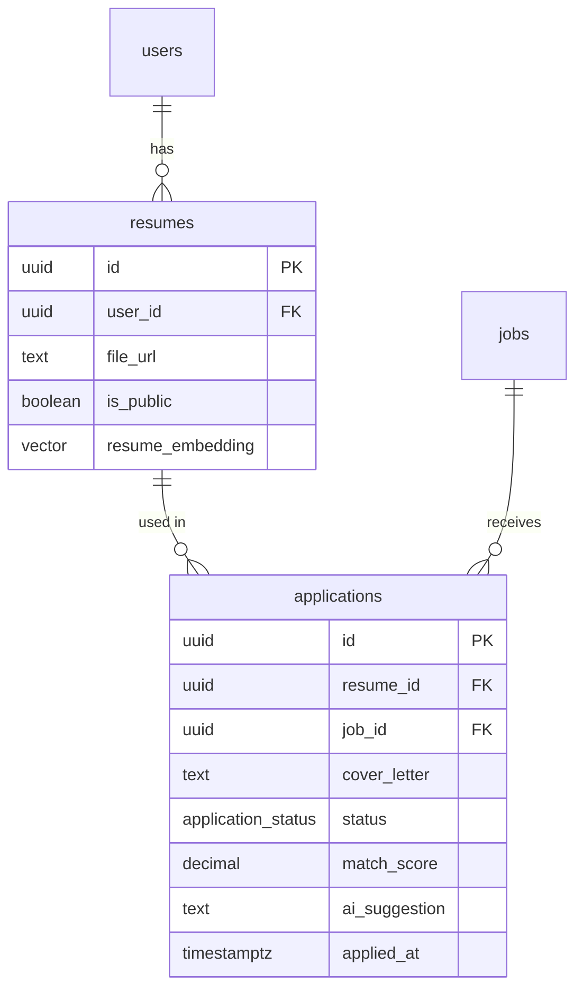

# Mô tả quan hệ giữa các bảng (Resumes & Applications)

Dưới đây là chi tiết cấu trúc và mối quan hệ giữa hai bảng `resumes` và `applications`.

## 1. Bảng `resumes` (Hồ sơ)
Lưu trữ thông tin về các tệp hồ sơ (CV) của người dùng.

| Trường | Kiểu dữ liệu | Ràng buộc | Mô tả |
| :--- | :--- | :--- | :--- |
| `id` | uuid | Primary Key | Định danh duy nhất của hồ sơ. |
| `user_id` | uuid | Not Null, FK | Liên kết với bảng `users(id)`. |
| `file_url` | text | | Đường dẫn đến tệp hồ sơ. |
| `is_public` | boolean | | Trạng thái công khai của hồ sơ. |
| `resume_embedding`| vector | | Vector hóa nội dung hồ sơ (phục vụ tìm kiếm AI). |
| `created_at` | timestamptz | | Thời gian tạo. |
| `created_by` | text | | Người tạo. |
| `updated_at` | timestamptz | | Thời gian cập nhật. |
| `updated_by` | text | | Người cập nhật. |

## 2. Bảng `applications` (Đơn ứng tuyển)
Lưu trữ thông tin khi người dùng ứng tuyển vào một công việc cụ thể.

| Trường | Kiểu dữ liệu | Ràng buộc | Mô tả |
| :--- | :--- | :--- | :--- |
| `id` | uuid | Primary Key | Định danh duy nhất của đơn ứng tuyển. |
| `resume_id` | uuid | FK | Liên kết với bảng `resumes(id)`. |
| `job_id` | uuid | Not Null, FK | Liên kết với bảng `jobs(id)`. |
| `cover_letter` | text | | Thư giới thiệu của ứng viên. |
| `status` | enum | | Trạng thái đơn (e.g, Reviewed, Rejected, Accepted). |
| `match_score` | decimal | | Điểm phù hợp giữa hồ sơ và công việc (tính bằng AI). |
| `ai_suggestion` | text | | Gợi ý/Nhận xét từ AI về đơn ứng tuyển. |
| `applied_at` | timestamptz | | Thời điểm ứng tuyển. |
| `created_at` | timestamptz | | Thời gian tạo record. |
| `created_by` | text | | Người tạo. |
| `updated_at` | timestamptz | | Thời gian cập nhật record. |
| `updated_by` | text | | Người cập nhật. |

## 3. Quan hệ (Relationships)

### 3.1. resumes - applications (1:N)
- **Loại quan hệ:** Một-nhiều (One-to-Many).
- **Chi tiết:** 
    - Một **Resume** có thể được sử dụng để nộp cho nhiều **Applications** khác nhau (người dùng dùng một CV để ứng tuyển nhiều vị trí/công việc).
    - Một **Application** tại một thời điểm cụ thể sẽ tham chiếu đến một **Resume** duy nhất.
- **Khóa ngoại:** `applications.resume_id` -> `resumes.id`.

### 3.2. Các quan hệ liên quan khác
- **users - resumes (1:N):** Một người dùng có thể sở hữu nhiều bản hồ sơ khác nhau.
- **jobs - applications (1:N):** Một tin tuyển dụng có thể nhận được nhiều đơn ứng tuyển.

## 4. Biểu đồ quan hệ (ERD)

